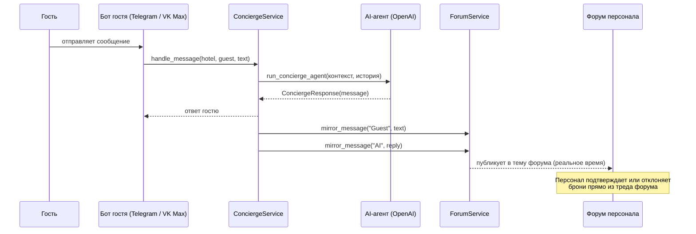

# AI Concierge Bot

> Мультиплатформенный AI-консьерж для отелей и вилл — отвечает на запросы гостей, зеркалирует переписку в форум для персонала и управляет бронированием через Telegram и VK Max.


---

## Как это работает



**Администратор отеля** управляет всем через отдельный admin-бот: каталог услуг, очередь броней, AI-промпт и статистика — всё через inline-диалоги.

---

## Возможности

| Функция | Описание |
|---------|----------|
| **AI автоответы** | Агент на базе OpenAI отвечает гостям на их языке, история переписки хранится в Redis |
| **Зеркалирование в форум** | Каждый обмен гость ↔ AI публикуется в реальном времени в отдельную тему Telegram Forum |
| **Бронирование** | AI ищет услуги и создаёт брони; персонал подтверждает или отклоняет прямо из форума |
| **Подключение сотрудника** | Персонал видит живую переписку в форуме и может вмешаться в любой момент |
| **Две платформы** | Бот для гостей работает в Telegram (aiogram) и VK Max (maxo); admin-панель только в Telegram |
| **Мультитенантность** | Один инстанс обслуживает несколько отелей — у каждого свой токен бота и изолированные данные |
| **Admin-панель** | Полный диалоговый интерфейс: управление услугами, брони, редактирование AI-промпта, статистика |

---

## Архитектура

```
┌─────────────────────────────────────────────────────────┐
│  Интерфейсы для гостей                                  │
│  tgbot/handlers/ (Telegram)   maxbot/handlers/ (VK Max) │
└────────────────────┬────────────────────────────────────┘
                     │
┌────────────────────▼────────────────────────────────────┐
│  Слой сервисов                                          │
│  ConciergeService  BookingService  ForumService         │
│  GuestService      NotificationService                  │
└──────┬──────────────────────┬──────────────────────────-┘
       │                      │
┌──────▼──────┐      ┌────────▼──────────────────────────┐
│  AI-агент   │      │  Слой DAO                         │
│  agent.py   │      │  HotelDAO  GuestDAO  ServiceDAO   │
│  tools.py   │      │  BookingDAO                       │
│  prompts.py │      └────────────────┬──────────────────┘
└──────┬──────┘                       │
       │                    ┌─────────▼──────────┐
       │                    │  PostgreSQL 16      │
       │                    └────────────────────-┘
┌──────▼──────┐
│  Redis      │  ← история переписки (последние 8 сообщений на гостя)
└─────────────┘
```

---

## Стек технологий

| Компонент | Технология | Назначение |
|-----------|-----------|------------|
| Bot framework | aiogram 3.x + aiogram-dialog | Telegram-бот и FSM-диалоги для admin-панели |
| VK Max | maxo SDK | Поддержка VK Max для гостевого бота |
| AI-агент | agent-framework + OpenAI API | Tool-calling агент со структурированным выводом |
| История переписки | Redis | Память на гостя, последние 8 сообщений, автообрезка |
| DI | Dishka | Инъекция зависимостей по скоупам (APP / REQUEST) |
| ORM | SQLAlchemy 2.0 async + asyncpg | Асинхронная работа с БД |
| Миграции | Alembic | Версионирование схемы |
| База данных | PostgreSQL 16 | Основное хранилище |
| Конфиг | pydantic-settings | Типизированный конфиг с поддержкой `.env` |
| Деплой | Fly.io | Webhook-режим, aiohttp, порт 8080 |
| Сборка | uv | Быстрое управление зависимостями |
| Качество кода | Ruff + mypy | Линтинг и типизация |

---

## Структура проекта

```
concierge_bot/
├── ai/                    # AI-агент
│   ├── agents/concierge/  # Агент, инструменты (search_services, create_booking), промпты
│   ├── middleware/        # Retry, логирование, structured-retry middleware
│   ├── history.py         # Redis-провайдер истории переписки
│   └── factory.py         # Фабрика агента (конфиг модели, поддержка reasoning-моделей)
│
├── dao/                   # Слой доступа к данным (только SQL, возвращает DTO)
│   ├── holder.py          # Агрегированный DAO, инжектируется в сервисы
│   ├── hotel.py / guest.py / service.py / booking.py
│   └── base.py            # Базовый DAO
│
├── db/                    # ORM-модели SQLAlchemy + Base
│
├── dto/                   # Pydantic DTO
│
├── services/
│   ├── concierge.py       # Главный оркестратор: AI → ответ → зеркало в форум
│   ├── booking.py         # Жизненный цикл брони: создание → подтверждение/отмена → уведомление
│   ├── forum.py           # Создание тем, зеркалирование сообщений, кнопки броней
│   ├── guest.py           # Получение или создание профиля гостя
│   └── notification.py    # Уведомления в admin-чат и личные сообщения гостю
│
├── tgbot/                 # Telegram-бот (admin + гость)
│   ├── dialogs/
│   │   ├── admin_main/    # Дашборд: инфо об отеле, кол-во ожидающих броней, навигация
│   │   ├── admin_bookings/# Список ожидающих броней + детали + подтвердить/отменить
│   │   ├── admin_services/# Управление каталогом услуг (добавить/просмотреть/удалить)
│   │   ├── admin_prompt/  # Просмотр и редактирование AI-промпта отеля
│   │   ├── admin_stats/   # Статистика броней по статусам
│   │   └── guest_services/# Каталог услуг для гостей + процесс бронирования
│   ├── handlers/          # Обработчики сообщений, callback-обработчики броней
│   ├── filters/           # Фильтры для admin/гость
│   └── middlewares/       # Прикрепление контекста (hotel, guest, dao)
│
├── maxbot/                # VK Max бот (только для гостей)
│   ├── handlers/          # /start, /mybookings, текст → ConciergeService
│   └── middlewares/       # Прикрепление контекста для VK Max
│
├── di/                    # Dishka DI-провайдеры
├── shared/                # Общие константы (категории)
├── migrations/            # Миграции Alembic
├── config.py              # Классы конфига на pydantic-settings
└── main_factory.py        # Фабрика aiohttp-приложения (webhook-режим)
```

---

## Локальная разработка

```bash
# 1. Установить зависимости
make install

# 2. Запустить PostgreSQL + Redis
make docker-up

# 3. Настроить окружение
cp .env.example .env
# Заполнить TELEGRAM_BOT_TOKEN, OPENAI_API_KEY, DATABASE_URL, REDIS_URL

# 4. Применить миграции
make db-upgrade

# 5. Запустить (polling-режим для разработки)
make run-polling          # Telegram-бот
make run-maxbot           # VK Max-бот (требует MAX_BOT_TOKEN)
```

---

## Деплой

```bash
# Задеплоить на Fly.io
fly deploy --remote-only

# Применить миграции в продакшне
fly ssh console --app bali-concierge -C "alembic upgrade head"

# Смотреть логи
fly logs --app bali-concierge -f
```

CI/CD: merge в `main` → GitHub Actions запускает `fly deploy` автоматически.
